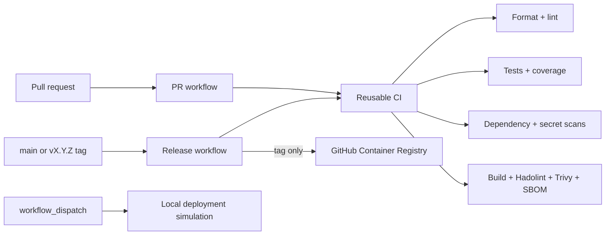

# FastAPI CI/CD Pipeline

[](https://github.com/German4341374/fastapi-cicd-pipeline/actions/workflows/release.yml)
[](https://github.com/German4341374/fastapi-cicd-pipeline/actions/workflows/deploy-simulation.yml)

A portfolio repository demonstrating a secure, evidence-producing GitHub Actions CI/CD pipeline.
The FastAPI service is intentionally small so reviews focus on automation, permissions, release
policy, supply-chain evidence, and rollback behavior.

## Architecture



## Technology stack

- Python 3.12.13, FastAPI 0.139.0, Uvicorn 0.34.0
- Ruff, pytest, pytest-cov, pip-audit, Gitleaks, Hadolint, Trivy, and Syft
- Docker multi-stage build and Docker Compose
- GitHub Actions reusable workflows, artifacts, caches, GHCR, and Dependabot

## Pipeline reference

| Workflow/job | Trigger | Permissions | Output and purpose |
|---|---|---|---|
| Pull Request Pipeline | PR targeting `main` | `contents: read` | Calls reusable CI; stale runs are cancelled per PR. |
| Release Pipeline / CI | Push to `main` or `v*.*.*` | `contents: read` | Calls the same reusable CI; release runs are serialized per ref. |
| Release / version | Semantic tag only | inherited read | Validates `vMAJOR.MINOR.PATCH` and exposes the version output. |
| Release / publish | Valid semantic tag only | `contents: read`, `packages: write` | Publishes version and `latest` tags to GHCR using GHA build cache. |
| Reusable / quality | Called workflow | `contents: read` | Ruff format and lint checks. |
| Reusable / unit-tests | Called workflow | `contents: read` | Tests, 90% coverage gate, XML coverage and JUnit artifacts. |
| Reusable / integration-tests | Called workflow | `contents: read` | HTTP application tests and JUnit artifact. |
| Reusable / source-security | Called workflow | `contents: read` | pip-audit and full-history redacted Gitleaks scan. |
| Reusable / container-security | Called workflow | `contents: read` | Hadolint, image build/smoke test, Trivy, CycloneDX SBOM, image archive. |
| Deployment Simulation | Manual `workflow_dispatch` | `contents: read` | Local image health check and 30-day deployment record artifact. |

### Artifacts

- `unit-test-results-*`: `coverage.xml` and JUnit XML, retained 14 days.
- `integration-test-results-*`: integration JUnit XML, retained 14 days.
- `container-evidence-*`: CycloneDX SBOM, image digest evidence, and gzipped image, retained 7 days.
- `deployment-simulation-*`: selected version, rollback target, and commit, retained 30 days.

Artifact names include `github.run_id` to avoid collisions. No artifact contains credentials.

### Security decisions

- The reusable and PR workflows cannot write repository or package state.
- GHCR credentials are the short-lived `GITHUB_TOKEN`; `packages: write` is job-scoped and tag-gated.
- Pull requests never publish images. Main validates, while only valid tags publish.
- Concurrency cancels outdated PR work but never cancels releases or deployment simulations.
- Full Git history enables secret scanning. Scanner output is redacted.
- Images run as UID 10001 with no capabilities, read-only filesystem, and a health check.
- Dependency, source, Dockerfile, container, and SBOM controls cover different failure classes.
- Dependabot proposes weekly pip, Docker, and Actions updates for review rather than auto-merging.

## Prerequisites

Use Linux or Windows with WSL2. Install Python 3.12, `python3-venv`, GNU Make, Docker Engine with
Compose v2, Git, and curl. No cloud account or long-lived credential is required.

## Installation and usage

```bash
make setup
make lint
make test
make audit
make up
curl --fail http://localhost:8000/health
make down
```

Create a release only after `main` is green:

```bash
git tag -a v1.0.0 -m "Release v1.0.0"
git push origin v1.0.0
```

The tag is validated before GHCR publication. Invalid or branch-based versions cannot publish.

## Verification commands

```bash
ruff format --check .
ruff check .
pytest tests --cov=app --cov-report=term-missing
pip-audit
docker build --target production -t pipeline-demo-api:local .
bash scripts/smoke_test.sh
bash scripts/semantic_version.sh v1.2.3
```

## Troubleshooting

- **Coverage fails:** add meaningful tests; do not lower the 90% gate to hide missing behavior.
- **pip-audit or Trivy fails:** identify the fixed version, update the pin/base image, and rerun.
- **GHCR publish is skipped:** confirm the ref is an annotated `vMAJOR.MINOR.PATCH` tag.
- **Artifact collision:** retain the run-ID suffix in artifact names.
- **Smoke test fails:** inspect `docker logs pipeline-demo` and the image health check.
- **Fork PR cannot publish:** expected; PR workflows intentionally have read-only permissions.

## Rollback

Container images are immutable semantic versions. Redeploy the last known-good version rather than
overwriting it. Use the manual Deployment Simulation with `version` set to the desired version and
`rollback_to` set to the previous version, then follow `docs/runbooks/rollback.md`. The project does
not mutate a real environment.

## Security considerations

Third-party Actions and tool images are version-pinned, permissions are explicit, and publication
is isolated. Version tags are mutable in Git unless protected by repository rules. For higher
assurance, pin Actions and images by digest, require signed tags, protect environments, and verify
provenance before deployment.

## Limitations

- Deployment is simulated on a GitHub runner; there is no real environment or cloud integration.
- No database or stateful migration is included in the deliberately small workload.
- GHCR publishing is not exercised until a semantic tag is intentionally pushed.
- Tag patterns are validated by a script because GitHub trigger globs are not regular expressions.
- Actions currently emit a non-fatal warning while official v4/v5 Actions transition runtimes.

## Future improvements

- Pin every Action and scanner image by digest and add Renovate policy controls.
- Add keyless signing, SLSA provenance, SBOM attestations, and verification before simulation.
- Add protected release environments, required reviewers, and signed-tag enforcement.
- Add matrix testing for supported Python versions and architecture builds.

## Interview talking points

- Why reusable workflows prevent PR/release policy drift.
- Why permissions are job-scoped and publication is tag-gated.
- Why scanners are complementary rather than interchangeable.
- How concurrency differs for disposable PR runs and non-cancellable releases.
- Why artifacts, SBOMs, coverage, and deployment records provide audit evidence.
- How immutable versions enable rollback without real cloud credentials.

See `DEMO.md`, `INTERVIEW.md`, and `docs/explanations/pipeline-reference.md`.

## License

MIT. See `LICENSE`.
